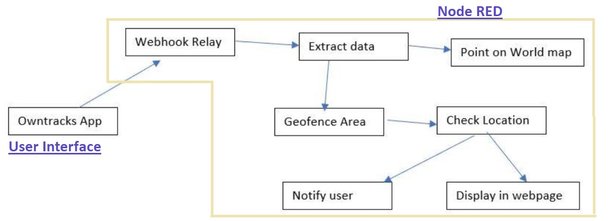

# CFC2020-Project-Monitoring-Geofence
The project aims to monitor the person by creating the Geofence on the map. It outputs the location coordinates of the user and displays whether the user is inside the Geofence area or not. It also helps to track the location of the user. If the user accidentally enters or leaves ‘Red Zone’ area, it helps to alert the user not to do so. Location details are sent from Owntracks to Webhook relay. Notifications to the user mobile can be send using the Push bullet to alert the user.

Due to this pandemic COVID, if there are more positive cases then that particular area is made “Red Zone”. If a person is in Red Zone area, by creating a Geofence in that area one can monitor whether the person is staying in the Geofence area or not. We can also track the location of the person. The person might be knowingly or unknowingly crossing or entering the ‘Red Zone’ area, it can also further helpful to alert the user not to do so.

The project is implemented using the Node RED instance from IBM cloud. The location of the user is relayed through the public webhook relay address. The public end point URL of the bucket is supplied to the ‘OwnTracks’ app which is installed in the user mobile. The secret encryption key set in the app is given as a secret to the owntracks node.
The webhookrelay node gets the location details from webhook relay bucket which is supplied by owntracks app. The location details are decrypted using the format JSON function node. The decrypted location details are further send to the worldmap and tracks node is used to update location pointer of the user. The location details are checked whether they exist in the geofenced area or not. After deploying, at the output a message whether the person is inside the area or outside the fenced area is displayed along with the location coordinates. The location of the user can be visualized in the worldmap from Node-RED.

This project can be further extended to store user location data in a cloud database for continuous monitoring with premium plan. It can be extended for tracking multiple persons. This may even help for contact tracing by finding the path user travelled. This project can also be improved to use for commercial marketing advertaisement purposes by sending notifications or messages when a person enters particular area. 

Video URL: https://vimeo.com/433331914

